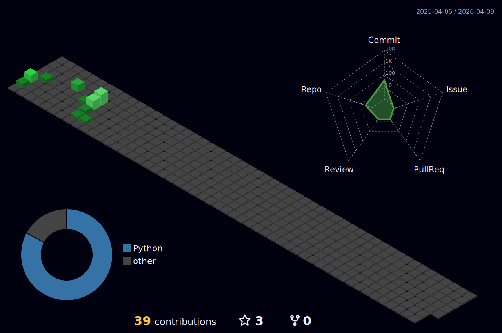

# 👋 Olá, eu sou o Vinny!

Sou desenvolvedor apaixonado por tecnologia, dados e automações.

## 📊 Contribuições em 3D

---

## 🚀 Tecnologias e Ferramentas que eu uso

### 💻 Linguagens

### 💾 Bancos de Dados

### 🧩 Frameworks e Bibliotecas

### 🛠️ Ferramentas e Plataformas

---

📫 Me siga no GitHub para apoiar o projeto: [@vinnyscosta](https://github.com/vinnyscosta)

<!--
**vinnyscosta/vinnyscosta** is a ✨ _special_ ✨ repository because its `README.md` (this file) appears on your GitHub profile.

Here are some ideas to get you started:

- 🔭 I’m currently working on ...
- 🌱 I’m currently learning ...
- 👯 I’m looking to collaborate on ...
- 🤔 I’m looking for help with ...
- 💬 Ask me about ...
- 📫 How to reach me: ...
- 😄 Pronouns: ...
- ⚡ Fun fact: ...
-->
